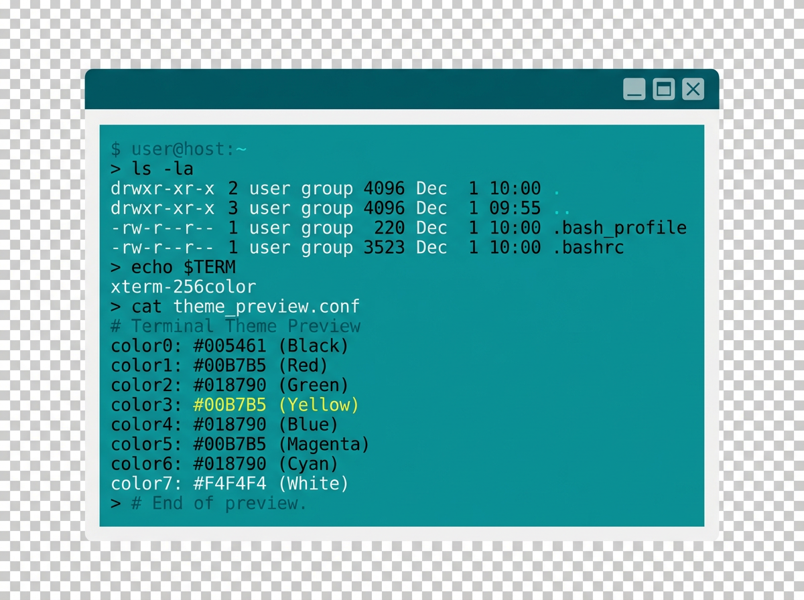
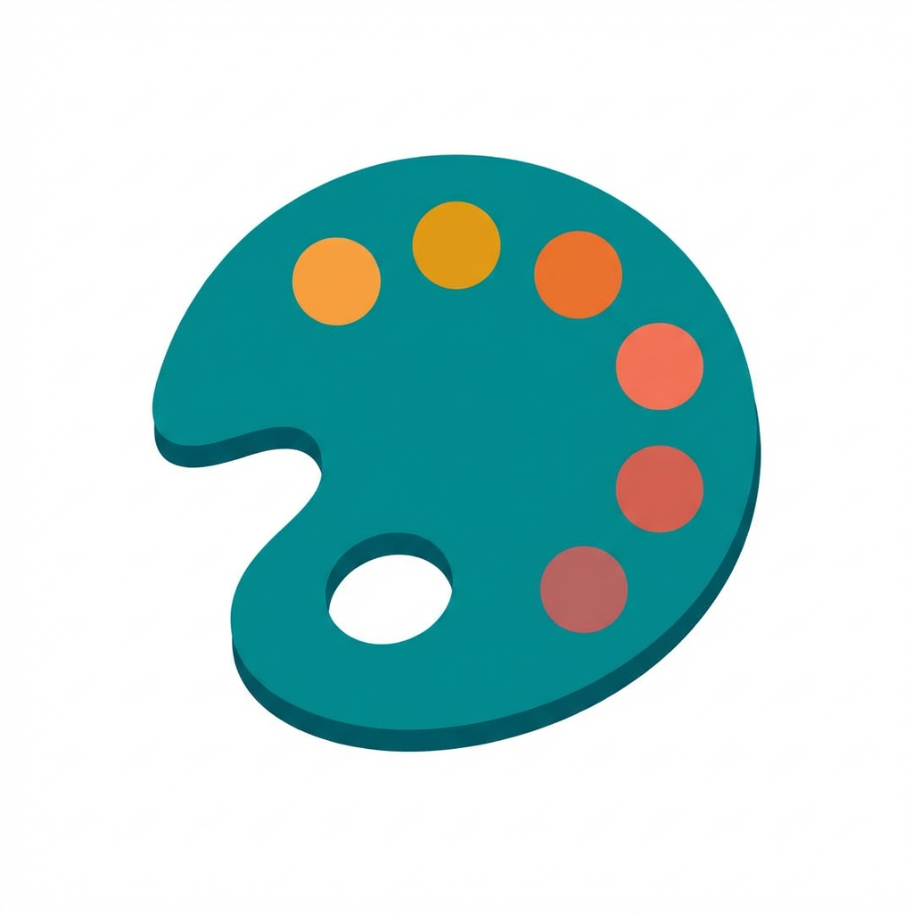
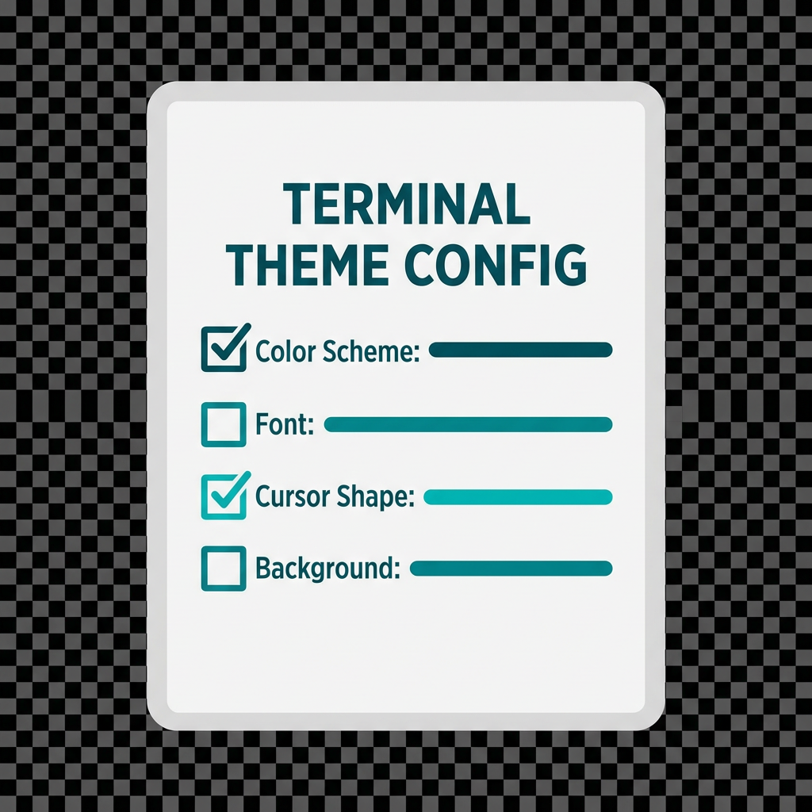

# NeoMutt Themes

<div class="hero-banner">
  <h2>🎨 Personalise Your Terminal Email</h2>
  <p>Browse, preview and install colour schemes for NeoMutt — the command-line mail reader that makes email truly awesome.</p>
</div>

<div class="feature-grid">

<div class="feature-card">
  
  <h3>Live Preview</h3>
  <p>See exactly how each theme will look in your terminal before you install it.</p>
</div>

<div class="feature-card">
  
  <h3>200+ Themes</h3>
  <p>A curated collection of TrueColor and 256-colour palettes sourced from popular terminal emulators.</p>
</div>

<div class="feature-card">
  
  <h3>Easy Setup</h3>
  <p>Download a single <code>.rc</code> file and <code>source</code> it in your <code>neomuttrc</code> — done!</p>
</div>

</div>

<hr class="section-divider">

## Theme Preview

Pick a theme from the dropdown or click a favourite to see a live preview of NeoMutt's Compose screen.

```{toctree}
---
maxdepth: 2
hidden: true
---
terminal.md
```

<label for="theme-picker">Theme:</label>
<select id="theme-picker" autofocus>
  <option value="dracula" selected>Dracula</option>
  <option value="solarized">Solarized</option>
  <option value="neon">Neon</option>
  <option value="gruvbox">Gruvbox</option>
  <option value="nord">Nord</option>
  <option value="monokai">Monokai</option>
  <option value="catppuccin">Catppuccin</option>
  <option value="tokyonight">Tokyo Night</option>
</select>

<label>Favourites:</label>
<button class="fav-btn" data-theme="dracula">Dracula</button>
<button class="fav-btn" data-theme="solarized">Solarized</button>
<button class="fav-btn" data-theme="neon">Neon</button>

<div class="term-window" data-theme="dracula">
  <div class="term-titlebar">
    <span class="blob red"></span>
    <span class="blob yellow"></span>
    <span class="blob green"></span>
    <span class="title">Compose</span>
  </div>
  <pre class="terminal">
<span class="status">q:Quit  d:Del  u:Undel  m:Mail  r:Reply  ?:Help                                                           </span>
<span class="header">        From: </span><span class="normal">Richard Russon &lt;rich@flatcap.org&gt;                                                           </span>
<span class="header">          To: </span><span class="normal">rich@flatcap.org                                                                            </span>
<span class="header">          Cc: </span><span class="normal">                                                                                            </span>
<span class="header">         Bcc: </span><span class="normal">                                                                                            </span>
<span class="header">     Subject: </span><span class="normal">test1                                                                                       </span>
<span class="header">    Reply-To: </span><span class="normal">                                                                                            </span>
<span class="header">         Fcc: </span><span class="normal">                                                                                            </span>
<span class="header">    Security: </span><span class="sign">Sign</span><span class="normal"> (PGP/MIME)                                                                             </span>
<span class="header">     Sign as: </span><span class="normal">0x69AD1D636AC292E820658C16EBC150E4B5DA63DF                                                  </span>
<span class="status">-- Attachments                                                                                            </span>
<span class="normal">- I     1 ~/.cache/mutt/neomutt-flatcap-1001-126075-5700879863971028336 [text/plain, 7bit, us-ascii, 0.5K]</span>
<span class="normal">  A     2 ~/work/themes/preview.md                                      [text/markdown, 8bit, utf-8, 3.6K]</span>
<span class="status">-- Preview                                                                                                </span>
<span class="normal">Yantic radicicolous phonotypic Sturmian numberless reformanda                                             </span>
<span class="normal">midleg undenotable adati bracelets theocrasia tomfool cramponnee                                          </span>
<span class="normal">shelta anconei leafmold Aguistin feldspathose emphatic hornworts                                          </span>
<span class="normal">kheth rotunda Riddlesburg well-indexed haurient transbaikal gemuti                                        </span>
<span class="normal">fragrance wide-accepted Shandee anchietin alycompaine unmigratory labefy                                  </span>
<span class="normal">aphronitre liberty preextensively hereticide tonnages swash Kerite                                        </span>
<span class="normal">auricula syntheticism amphibia Cyrillian disputatiousness effeminate                                      </span>
<span class="normal">neper rockiness top-hat                                                                                   </span>
<span class="normal">                                                                                                          </span>
<span class="status">-- NeoMutt: Compose  [Approx. msg size: 4.1K   Atts: 2]---------------------------------------------------</span>
<span class="normal">                                                                                                          </span>
</pre>
</div>

<hr class="section-divider">

## How to Install a Theme

1. Visit the **[Theme List](terminal.md)** and find a theme you like.
2. Click the **truecolor** or **palette** link to download the `.rc` file.
3. Save it to your NeoMutt config directory (e.g. `~/.config/neomutt/`).
4. Add a single line to your `neomuttrc`:

   ```
   source ~/.config/neomutt/dracula.rc
   ```

5. Restart NeoMutt — enjoy your new look! 🎉

<script>
function setTheme(theme) {
  document.querySelector('.term-window').setAttribute('data-theme', theme);
  document.getElementById('theme-picker').value = theme;
}
document.getElementById('theme-picker').addEventListener('change', function() {
  setTheme(this.value);
});
document.querySelectorAll('.fav-btn').forEach(function(btn) {
  btn.addEventListener('click', function() {
    setTheme(this.getAttribute('data-theme'));
  });
});
</script>
